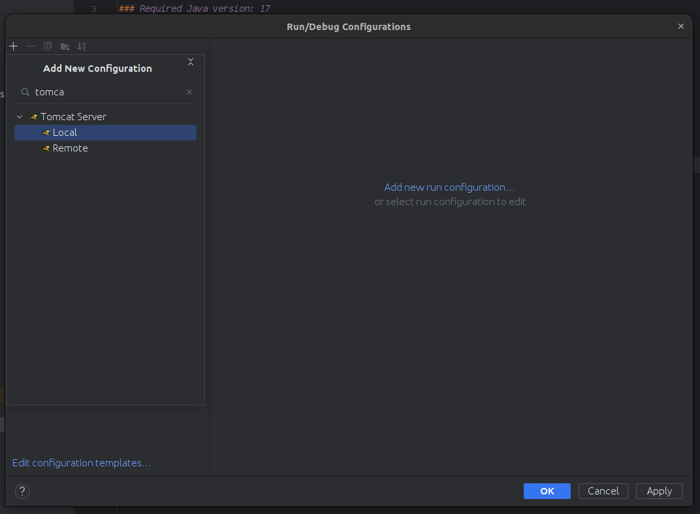
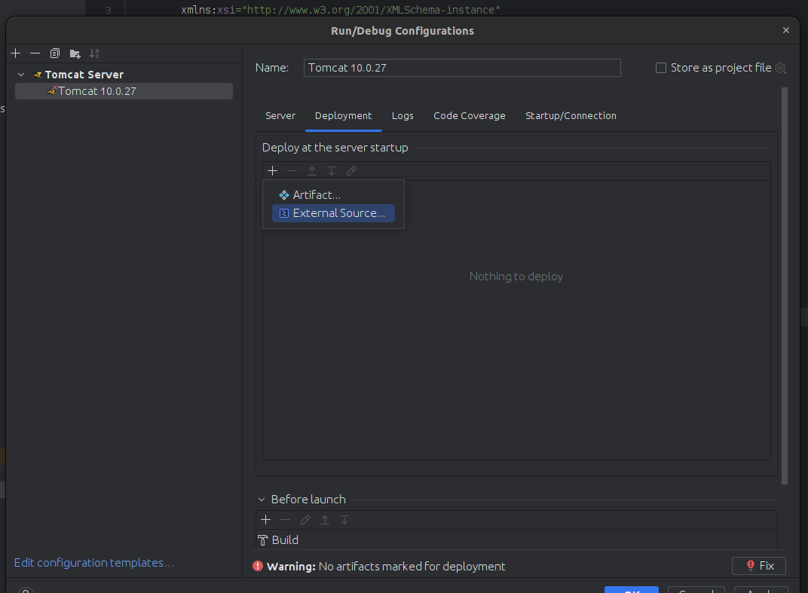
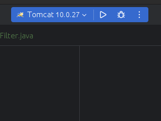
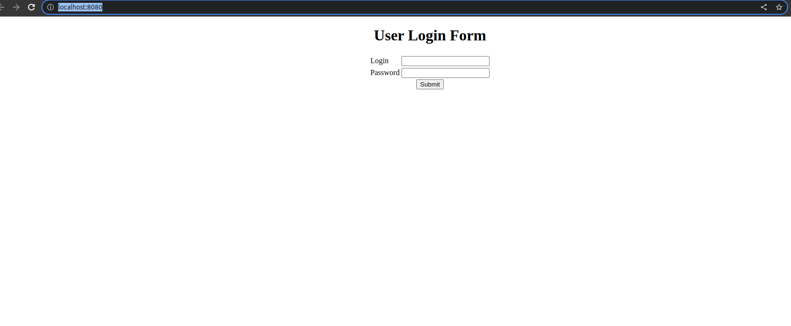
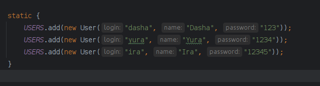

## Run requirements:
### Required Tomcat version: 10.0.27
### Required Java version: 17


**Step 1:**
Run the following command to build the .war file:
```shell
mvn clean install
```

**Step 2:**
1. Run the application using InteliJ Idea 2022.3


2. Add executable .war file to run the application via Tomcat.
3. Remove extra application context
4. Press Ok

5. Run the application:

6. Follow localhost:8080 in your web browser

7. Input one of these in-memory credentials:

8. Press Submit